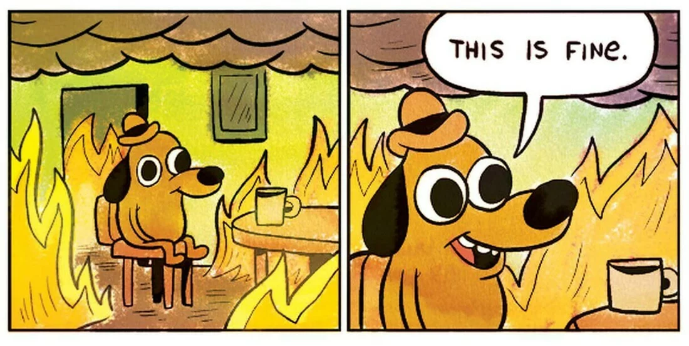

# Soulslike Impact
<br>


# Week One


## Colour Blindness


- Different colour blindness can perceive colours differently.
- Symbols are a main way to show differences. Caduceus for health, or a heart symbol
- Consider haptic feedback with a controller, consider a heartbeat
- Make the edge of the screen darker to show the
 - Audio for healing potions and taking damage, or a heartbeat
---
 <br>
 <br>


## Controller Support

 - The Playstation 5 controller has a different scheme to the Playstation 4 controller.
  - Uses completely separate axis settings, needing a lot of trial and error to find the correct settings.
  - The Playstation 4 controller uses 'Generic Gamepad Axis 1 through 3, whereas the Playstation 5 controller Uses 'Generic Gamepad Axis 4 through 7
  - Mapping buttons to specific actions was incredibly easy, just requiring a new input for specific buttons. However, I also had to create multiple new keybinds, such as;
    * Dodge/Run,
    * Light Attack,
    * Heavy Attack,
    * Drink Potion,
    * Collect/Switch Items,
    * Lock on,
---


<br>
<br>


## Movement System

 - The Movement system is rather simplistic, being based on other souls-like games
 - There are three new movement buttons:
   * Sprint
   * Backstep (Tap sprint button while not moving)
   * Dodge (Tap the sprint button while moving.)


 - Soulslike games put emphasis on timing and being careful with movements. So This is what I am using for my movement system. I want it to be very similar, so there will be fewer movement options.
 - However, Like other soul-like games, I will be including a lock-on system, which makes it a little easier for people in games such as this, where enemies have such large and coordinated movements.
---
 <br>
 <br>

## Weapons
### Weapon Types
---
There will be a few different types of weapons, each with its own set of animations. These types are:
  * Swords, which have a very short range
  * Spears, which have a long-range, but only stab
  * Scythes, which have a long-range, slashing at the enemy(s)
  * Greatsowrds, which have a medium range, slashing the enemy(s)
Alongside this, there will be a different type of stats for each weapon.
----
### Weapon Stats
---
 Each weapon will have three main Stat - Damage, Attack Speed and Stamina Drain. All of which are rather easy to understand what they will do. I will also have different stats for different weapon types, some can be shared, others cannot.
  - Shared stats;
     * Bleed
     * Slowness
 - Sword Stats;
   * Poison
- Spear Stats;
   * Piercing
- Scythe Stats;
    * Fire,
    * Lifesteal,
 - Greatsword Stats;

## Research

## Respawn System

For the respawn system I wanted to use one that had the iconic 'You Died' System from all the soulslike games. This will include a slow death animation from the character, before the dark bar appears on screen, with the 'You Died' text.

](image.png)
*Figure 1. Shows an example of a death screen from the game Dark Souls One(2013).*
I wanted to stick as close to the original source as possible. This was done by creating a new User Interface that would pop up when a player died. This would then call up the small animation I had created for the UI, the black bar and red text showing up for a moment before vanishing. This UI is then instantly killed as it is no longer necessary.

---

<br>
<br>

# Task 1
---
### Research
--- 
- For this task I assumed that a bubble sort would be best. It was the best for small sets of data and would be much quicker than any other type of sort.
- However found a sort algorithm that is built into C++. 
- std::sort in C++ is a highly optimized sorting function that typically uses a hybrid algorithm called Introsort. Introsort begins with Quicksort for efficient average-case performance (O(nlog⁡n)O(nlogn)), but if the recursion depth exceeds a certain threshold (indicating that the data may be poorly partitioned), it switches to Heapsort to ensure the worst-case time complexity remains O(nlog⁡n)O(nlogn). For small datasets, std::sort may also use Insertion Sort for better performance. Overall, it is designed to provide fast and reliable sorting across a wide range of data types.

<br>

### Bubble sorts
---
- Bubble Sort is a simple sorting algorithm that repeatedly compares adjacent elements in a list and swaps them if they are in the wrong order. This process continues until the list is fully sorted. Its time complexity is O(n2)O(n2) in the worst and average cases, making it inefficient for large datasets, but it has a best-case time complexity of O(n)O(n) if the list is already sorted. Despite its inefficiency, Bubble Sort is easy to implement and works in-place, meaning it requires minimal additional memory.

<br>

## Outcome of the task
- Ultimatly this task was made much easier by using the code. It was very much easier to use the std::sort.
- I think I saved a lot of time compared to using a bubble sort. Instead of being done in a few lines, it took me 8 lines total to write the sorting for both items in both orders. Thankfully it was done very easily. 


``` 
Void SortByName(std::vector<Item>& items, bool ascending = true){
    if (ascending)
        std::sort(items.begin(), items.end(), [](const Item& a, const Item& b) { return a.name < b.name; });
    else
        std::sort(items.begin(), items.end(), [](const Item& a, const Item& b) { return a.name > b.name; });
} 
```

- I then wanted to test this, to see if I could input my own items and have them also be ordered correctly. I also wanted to see if there were any flaws with it. Thankfully the system proved me right, and so ordered items easily.

``` 
// Function to add a new item to the inventory
void AddItem(std::vector<Item>& items) {
    std::string name;
    int value;

    std::cout << "Enter item name: ";
    std::getline(std::cin, name);
    std::cout << "Enter item value: ";
    std::cin >> value;
    std::cin.ignore(); // Clear the newline character from the input buffer

    items.emplace_back(name, value);
    std::cout << "Item added: " << name << " with value " << value << std::endl;
}
``` 

<br>

---

---

# Week 2

### Controller Support
 - Controller support became an issue. Playstation controllers were unusable after Unreal Engine 5. Controllers require a plugin that has not been updated and therefore is very unreliable. So after long enough of attempting to fix the issues, I had to give up with PlayStation four or five controllers.
 - However, I also had plans to use Xbox controllers, which are supported by Windows, and therefore are easy to set up with the controller. After this, all I needed to do was to make a bunch of extra input actions for every single button, which didn't take long at all.

---

### Player UI
 - Created the UI
 - Made a simple health bar, with the plan to add the stamina bar in the future. I then also added the visual of an Estus Flask as a temporary object for the prototype, which I will have to amend in the future. Since then I also added a small image above the health flask to show what weapon the player had equipped.
 ---

 ### Research
 ---
 - For this week I researched the Minecraft modpack 'Vault Hunters (Iskallia)'. It is a mod pack based around looting dungeons for new weapons, resources and upgrades for your Minecraft world. One of the key features is the randomized gear, which you can gain gear from little crates, or random enemy or chest drops from the vaults.
 - The randomized gear can have different status effects, from higher damage, to quicker attack speed. The full list is;
    * Attack Damage
    * Attack Speed
    * Durability
    * Chaining
    * Soul Chance
    * Effect Clouds
    * Effect Chance
- These can be found or crafted, with percentage chances on the modifiers on the weapons. The amount of modifiers and the percentage of the modifiers are affected by the rarity of the weapon itself. I looked at these weapons and thought it could be a unique and interesting way to fight enemies, making it a unique game.
- An example of this could be: I have an element called Frost, when you hit an enemy with a weapon imbued by frost, they will slow by a certain amount.
- When hit, they will have a build-up of frost, for this example, I will say it is a build-up of 33% a hit.
  * Hit 1 - 33% build-up, 33% slowed
  * Hit 2 - 66% build-up, 66% slowed
  * Hit 3 - 99% build-up, 99% slowed
  * Hit 4 - 100% build-up, 100% slowed
- When it hits 100% build-up, It will trigger a further status effect. In this example it is shatter, which will deal a percentage of damage to the enemy, changing based on resistance.
---

<br>
<br>

# Task 2
---

### Research
---
- Waterfall: A linear, sequential approach where each phase (requirements, design, implementation, testing, maintenance) is completed before moving on to the next. It's structured but inflexible.

-  Agile: An iterative, flexible approach focused on collaboration, continuous improvement, and delivering small, incremental updates. It emphasizes adaptive planning and customer feedback. Popular frameworks include Scrum and Kanban.

-  Scrum: A subset of Agile, Scrum divides development into short, time-boxed iterations called sprints. It emphasizes roles (Product Owner, Scrum Master, and Development Team) and regular meetings (daily stand-ups, sprint reviews).

-  DevOps: Focuses on collaboration between development and IT operations to automate the processes of software development, testing, deployment, and monitoring, aiming for continuous integration and delivery (CI/CD).

-  Extreme Programming (XP): An Agile-based methodology that emphasizes technical excellence, continuous feedback, and close collaboration between developers and customers. It advocates practices like pair programming, test-driven development (TDD), and frequent releases.

-  Lean: Originating from manufacturing, Lean software development focuses on maximizing customer value while minimizing waste. It emphasizes efficiency, continuous improvement, and faster delivery of smaller features.

Each methodology has its own strengths, and the choice depends on project size, complexity, and team dynamics.

<br>

## Outcome of the Task

- Here I decided to use the Agile methodology system. It would make it a lot more flexible and allow for plenty of feedback.
- Additionally it allows for any changes to be made easily.
- https://trello.com/b/02gvXJEQ/educational-maths-game 
- I created the Task on trello and added labels and time for testing for each developer.


*Figure 2. Shows a picture from trello, showing the segements of the tasks.*

- Ultimatly  I think this was a well done task. It also helped me organize how to do my own tasks and seperate them properly. 


---
---

<br>

# Week :3
---
<br>

## Randomized Weapons

 - The random weapon system is rather simple when made.
 - When you get to an actor that will be a chest, the player will use the interaction button. From there, the blueprint will begin to randomize the new weapons stats.
 - The blueprint will first decide the weapon rarity, choosing from:
    * Common
    * Uncommon
    * Rare
    * Ultra Rare
    * Legendary
    * Chaos
 - Each weapon will have different Stats, and different weapon types have different status effects. The common weapons will have very basic stats, having a maximum of ten damage.
 <br>
 <br>
 
*Figure 3. Shows a picture of the weapon damage function, and it shows the way it is set up.*
---
<br>
- This same setup is how I have created the rest of the weapon stats. I got a rarity, gave it a max and a minimum number for the stat and got a randomized number. Each of the rarities has increasingly higher numbers for the stats.
- The chaos tier is different, however. Inspired by a friend, I decided to create a tier that was quite literally 1-100. These weapons could have 1 Damage, but 100 attack speed.
- When it comes to the additional statuses on the weapon, I originally had the idea of having a random number of stats, so a weapon could potentially have effects such as Bleed, frost and life steal on it. However thinking about this, it would be far too overpowered, especially for a game inspired by games such as Dark Souls(2013), which are notoriously difficult.

<br>
<br>

## Issues
- Here I found an interesting issue. I originally wanted to store the weapon data instructions. I wanted to have 5 different structs to store the data for 5 separate weapons. However, when I tried to store data in them, and then call them in the future, I couldn't find any way to access them. Even directly after I had just set the data in the struct.
- I couldn't find any solution to this issue, nor could I figure out any way to get the structs to work. So in the end I simply made the variables themselves and gave them to the player, with plans to have other weapons be sent to separate actors with the individual stats. This works now, as I can set new weapons.
- In the full game, I will modify the spawner so that it creates weapons that are considered Actors so that the player can have full control of what weapon they are currently using.

<br>

---
---
# Task 3
---

## Research
- Greedy Algorithms: These algorithms make the locally optimal choice at each step with the hope of finding a global optimum. They are often used in optimization problems like the Knapsack Problem and Dijkstra's Algorithm for shortest paths.

- Divide and Conquer Algorithms: These algorithms break a problem down into smaller sub-problems, solve them independently, and combine the results. Merge Sort and Quick Sort are examples that use this approach to efficiently sort data.

## Outcome of the Task

- This was rather simple, I needed to choose a algorithm to use. I used a Greedy alogithm as they would make the best choice at each step and are used for the shortest path. 
- There was no point as trying to use a Devide and Conquer algorithm, as there was no reason to split up a simple task.

```
while (player.currentHealth <= player.maxHealth - lowestHeal)
  {
  std::cout << healthNeeded << std::endl;
  while (healthNeeded >= potions[healthindex].healingValue)
    {
    numOfPotions++; healthNeeded = healthNeeded - potions[healthindex].healingValue;
    player.currentHealth = player.currentHealth + potions[healthindex].healingValue;
    }
  healthindex++;
```
- This works, and I tried to add in a Supreme healing potion and a new character who only had 15 health. The system quickly adapted to the addition and healed the player!

---
---

<br>

# Week 4

## Basic enemies
 - I wanted to create enemies for the prototype who had the functionality to walk up to the player and attack them. Apart from that, they did not need much more.
 - In the future, I plan on making sure the enemies will be equipped with shields and can block the player's attacks. But that will be in the full game, not the prototype.
 - I created a basic pawn, before giving it an AI controller. This of course, then ran the blackboard, which was simple. The only commands the enemies have are to locate the player, move to the player and then attack the player.
 - It was simple to do, as soon as the enemy was in range, they would attack the player. I did this by starting a function, which checked to see if they were already attacking. If they were not, it would play an anim montage. During this, it would cast to the player, and deal damage to the player.
 - I created an animated montage because I wanted to add more animations in the future and allow flexibility for child actors.
<br>
- Originally, I had no delay between the animations, at which point I found out that the enemy could attack me as quickly as there were frames. This was found out in the first test, when an enemy dealt too much damage to me, an issue that was quickly fixed.

<br>

---
---

# Task 4
---

## Research
- For this task we were instructed work in pairs, as well as also use a language we were unfamilliar with. So, that meant I had to learn how to do C#
- This provided a problem for me, so we went to look for new information and ways to solve this.
- Chat GPT helped provide useful insight to this, allowing us to figure out how we could solve it.


How Dialogue Trees Work:

    Root and Nodes:
        A dialogue tree begins with a root node: this is where the conversation starts.
        Each node in the tree represents a point in the dialogue, often showing what a character says.
        Each node has one or more edges (branches), leading to new nodes based on the player's choices.

    Player Choices:
        After each piece of dialogue, the player is given a set of choices (typically shown as a list of options).
        Each choice leads to a different node, which may either provide more information or branch further into new dialogue options.

    Branching:
        As the player progresses through the dialogue tree, the conversation branches off depending on the choices made. Some paths may loop back to previous nodes, while others lead to unique outcomes or new nodes.
        In complex trees, decisions can affect the game or story in different ways (e.g., changing character relationships, unlocking secrets, or influencing the narrative's outcome).

    Endings or Outcomes:
        At the end of some branches, the dialogue may conclude, and the player returns to the main flow of the game.
        In some cases, choices can lead to multiple endings or unlock specific quests, creating a non-linear experience.

## Outcome of the task

- Ultimatly the outcome for the task was quite simple. Once we had gotten the basics down, it became much easier to make more.
- We broke what we had to do down into pseudo code, before then writing it up in code.

```
   // Example of building the dialogue tree:
        DialogueNode introduction = new DialogueNode("Hello! How can I help you today?");
        DialogueNode weather = new DialogueNode("The weather is great! It's sunny outside.");
        DialogueNode directions = new DialogueNode("You need to head north and then turn left.");
        DialogueNode goodfarewell = new DialogueNode("Goodbye! Have a nice day.");
        DialogueNode badfarewell = new DialogueNode("bye. Have a day.");
        DialogueNode rudefarewell = new DialogueNode("Wow! Fuck off");

        // Add choices to the root node
        introduction.AddChoice("Tell me about the weather.", weather);
        introduction.AddChoice("I need directions.", directions);
        introduction.AddChoice("Nothing, just passing by.", badfarewell);
        introduction.AddChoice("Screw you!", rudefarewell);

        // Add choices to the weather node
        weather.AddChoice("Thanks!", goodfarewell);

        // Add choices to the directions node
        directions.AddChoice("Thanks for the directions!", goodfarewell);

        // Now, set the root node in the DialogueSystem to the introduction
        RootNode = introduction;
        CurrentNode = RootNode; 
```
- This is what we wrote.
- The tree starts with the introduction, giving the text before then directing the code to the next part. 
- Then we can go to the directed part. 
- If we want to end, we simply do not designate the next path foreward. 

- I found this to be a rather simple way to create the trees. I liked this branching tree and thought iit was very nice to learn how to make. I would love to try and impliment this for a text based game in the future.
 
<br>

# Week 5 

## Lock on system

- For my game, I decided to use a lock-on system for the enemy. This means that no matter where the enemy is, the camera will always lock on to the enemy, and will face. I took inspiration from other games that have similar features.
- Some games like the Souls games have a hard lock-on, in which you have to actively select the enemy you wish to lock onto and target. However other games such as Dragon Age: Veilguard has a soft lock on. It doesn't restrict your camera and will allow you to look freely around. However, in the interest of attacking, it will lock you onto one character, that you can easily look away from.
- The system itself is rather simple. All I had to do was to create an input to lock on. Tab on PC, and press in on the camera joycon on the controller. These, I have found, are often normal controls for this type of system.
- When pressed, it will send a sphere trace. The starting point will be the player, the endpoint will be the camera direction, set a distance away from the user. Once it finds an enemy, it will set the rotation of the camera to be facing the target.
- I did find, however, that in most cases all you would be able to see is simply behind the player, so I made sure the camera was slightly elevated so that it was always possible to see enemies directly in front of you.

<br>

---
---

# Task 5

## Research
- This was the task I had the most difficulty with. It was really confusing for me. I tried very hard to do this, and took forever.
- Eventually I went to research different searches.
- GeeksforGeeks was increadibly useful to help this, it helped me learn about 
- Exponential Search (also known as Exponential Binary Search) Explanation:

- Exponential Search is an efficient algorithm used to find the position of a target value within a sorted array or list. It works by first exponentially expanding the range of indices until it either exceeds the target value or finds a suitable range that contains the target. After that, it applies binary search within the identified range to find the exact position.
Steps:

 - Why use Exponential Search?
    * Efficiency: Exponential search is especially useful when the target value is unknown and might be near the start of the array. By exponentially increasing the range, you can quickly find the region where the target might exist, then use binary search (which is more efficient than linear search) to locate the exact index.

    * Exponential Search has a time complexity of O(log n), making it more efficient than a linear search (O(n)) but not quite as efficient as a pure binary search (O(log n)). However, it performs better in unsorted data with certain conditions or when the target is near the start.

## Outcome of the task

- This task was the hardest, but when I completed it I was increadibly happy.
- However I am not particualrly happy with how I left it. While it works up to spec, I couldnt figure out how to make it work with only half done names. For example, if I put in 'Poison' it will simply come up with nothing. No matter how hard I tried, I couldnt get it working.

-Reguardless, I was happy as to how I got the rest working, the exponentual search:

```
// Exponential Search function to find a spell by name
int ExponentialSearch(const std::vector<Spell>& spells, const std::string& keyword) {
	if (spells.empty()) return -1;

	// Check the first element
	if (spells[0].name == keyword) return 0;

	int i = 1;
	// Exponentially increase i until we find a range where spells[i] is greater than the keyword
	while (i < spells.size() && spells[i].name < keyword) {
		i *= 2;
	}

	// Perform binary search in the range [i/2, min(i, size-1)]
	int low = i / 2;
	int high = std::min(i, (int)spells.size() - 1);
	while (low <= high) {
		int mid = low + (high - low) / 2;
		if (spells[mid].name == keyword) {
			return mid;
		}
		if (spells[mid].name < keyword) {
			low = mid + 1;
		} else {
			high = mid - 1;
		}
	}

	return -1; // Spell not found
}
```
- The search will get the word the player enters.
- It will then begin to expand the range.
- The binary search will begin, checking the first half of the range, before checking the second half
- if not found within the range, it will expand and repeat.


---
---

<br>

# Week 6
 
 ## Fighting system
- For this, I knew I already wanted three types of attacks.
  * A basic attack.
  * A heavy attack.
  * A special attack.
- For these, I got the three animations. I then had to figure out how to retarget animations. It took me a while to figure out how to do this, before then suddenly finding the button simply titled 'Retarget Animation'. I retargeted all three animations, before setting up the buttons, below is how it works:
  * The button is hit, and it checks to see if you are already attacking.
  * If not, then it will disable the player's movement.
  * Afterwards, it would then play the animation montage.
  * During certain points in the animation, it would start an anim node titled "hit"
  * "Hit" would then draw a line trace down the weapon length, before checking to see if it hit enemies.
  * Once hit, it will deal damage to the enemies and allow the player to move.
  * Then the system would say you are no longer attacking.

- Here I once again used anim montages. This is for future support. In the future, I plan on adding more animations for basic attacks, as well as different weapons.
- Each weapon will have its own moveset, as well as its own special attacks. At the moment I only have one type of weapon and one moveset, but plan to have multiple more.

<br>

 ## Weapon Affliction system
 - The weapon affliction system was nice and simple.
 - The overall idea is that separate weapons will give different effects, based on whatever the random effect that they spawned with was. I then gave each of them a build-up number. When hit with this, the enemy would have a constant build-up of the effect.
 - When the build-up would reach 100% then it would trigger the effect.
    * Frost will shatter the enemy, killing it the most.
    * Fire will cause an AOE attack.
    * Lifesteal will damage the enemy and heal the player
    * Scarlet rot will slowly the enemies over time.
    * Bleed will damage the enemy for a percent of their remaining health.
- However, most of these do not have functionality. This is due to the fact that I overestimated the time that making the weapon rarity system would take, as I kept rewriting the system.

<br>
<br>

# Task 6

## Research

- This was the task that I felt most confident on at first, the idea being pretty simple.
- Originally I was looking at Minecraft as an example, to see if I could gain any ideas from it.  However, as I continued to look, I found absolutly nothing. No one had any in depth explanation. The closetest I could could find was:
  * 

<br>


# Week 7

## Dodging
- I wanted a dodge that was functionally similar to a roll, where for a few moments you will be invincible. So that you dodge out of the way of attacks.
- However, I wanted to do a quick dash out of the way instead of a dodge. I chose that it would work as such:
  * You go invisible
  * You dash forward
  * You become visible.
- When making this, I encountered a simple issue. Instead of dashing the way the player was facing, you would dash in a single direction, no matter what direction you were facing.
- This was due to the fact I was using the capsule component, which didn't change directions. To fix this I would then quickly add an arrow to the player. I got the world location and forward vector, multiplied by 25, before adding to the player's current world location. This then worked, allowing me to get the direction the player was facing.
- I didn't want this to work via the camera, as when playing on the controller it can be quite slow. And when needing to press at a moment's notice, having it based on the direction you are moving is a lot more pleasing for the player's experience.

---
---


<br>

# Task 7
---

## Research
- For this task, it was once again a paired task. Together we tried to tackle this.
- We had a website that gave us a brilliant example of how to create a cake using the decorator patten! 
- After searching I was unable to find the same website, and so had to use chat GPT to give me the example.
---
- Decorator Pattern Explained Using a Cake Example:
  * Basic Cake: Imagine you have a basic Cake class. This class might have methods like getCost() and getDescription().
  * Decorator: Instead of modifying the Cake class directly, you use decorators. Each decorator adds a new feature to the cake, such as frosting, sprinkles, or layers of fruit.
  * Example:
        ChocolateFrostingDecorator might add the cost and description of chocolate frosting.
        SprinklesDecorator might add sprinkles to the cake and update the description accordingly.

- This allows you to create various combinations of cakes by stacking different decorators, each enhancing the base cake with new features.

## Outcome of this task

- One of the first requirements of the task was to create multiple classes. We did that very simply like so:

```

   character->strength = 10;
            character->endurance = 7;
            character->intelligence = 3;
            break;

        case CharacterClass::Rogue:
            character->agility = 10;
            character->luck = 7;
            character->strength = 4;
            break;

```
- This easily allows you to edit and make new classes. Its very simple.

```
    CharacterFactory* factory = new CharacterFactory();

    Character* char1 = factory->CreateCharacter( myString, CharacterClass::Cleric);
    char1->PrintCharacterInfo();

    Character* charMod1 = new SwordDecorator(char1);
    charMod1->PrintCharacterInfo();

    Character* charMod2 = new ShieldDecorator(char1);
    charMod2->PrintCharacterInfo();

    Character* charMod3 = new RingDecorator(char1);
    charMod3->PrintCharacterInfo();
```
- Here was how we set up the decorators. We made a new character that would then be set as the newest modified character. It would then print out the character and their stats, showing each modified output like so:

]
*Figure 4. Showing an image of the newly created character and the stats being assigned and updated.*


---
---

<br>

# Week 8


## Testing


 - It was at this point where I would get some testers to test this for me. I got a total of
 three testers who had never played a game like this, to come and try it.
 - I got a little bit of feedback, most of which caused a lot of things that I needed to update and tweak. The list being:
    * Attacking feels slow.
    * The enemies can always hit you, no matter what
    * The health potions didn't work
    * The attacks sometimes didn't hit.


- All of this was good feedback as it allowed me to at least fix some major issues.
- Additionally, it let me know that the game worked, the testers told me what they would like to see, as well as how
easily they could understand the controls.

## Dungeons

- For my game, I wanted dungeons that players could easily traverse and fight their way through to get new weapons
- The enemies are all very basic, but in the dungeons there can be enemies that can swarm the player, encouraging them to
play carefully.
- I made three dungeons, all with at least one room, with a portal to the main level, as well as what will be a loot chest in the
future. All of the dungeons needed a way to spawn the enemies. I created a spawner that would get a number between a preset range.
It would then check if the current amount spawned was equal to the number, and keep spawning until it was. However, I noticed an issue with this.
Sometimes, the spawner would just spawn an infinite amount of enemies, constantly making sure the player could never progress.
- The issue was that the random number generator would constantly give a new number when checking against it, and sometimes would never hit the intended number.
This was simply fixed by the fact that I would set the random number before the loop started. This made sure the function worked correctly.
- I then also made a variant of this spawner that would spawn in a boss.


- An additional feature is the door to progress. If the player walks into it, and there are still enemies left, it will not allow the player to progress.
However, if there are no enemies left, or the Bosses health is 0, then the door will open, allowing the player to head inside.

<br>

# week 9

## Major Issues

- So, here I was going to fix some of the major issues with the game. The issues were:
    * Enemies could hit you from anywhere
    * Sometimes the weapon wouldn't hit
    * The randomised weapons were not randomizing.
---
- Thankfully these issues were rather easy to fix as it turned out.
- For the weapon not being able to hit, it seemed to be because the sphere trace I made for the weapons was simply too
small, meaning that I needed to increase the size. Thankfully it worked, so the weapon will now reliably hit.
- The randomized weapons not working was a simple fix. I had to send the data to the player itself, rather than saving it in a
struct, which should have worked. But regardless it now works, allowing me to easily access it with no issue. I did speak about it
up above, but thought I would mention it at the point I discovered the issue.


- Finally, the other major issue was the enemies being able to hit from anywhere. This, of course, is an issue.
What was happening is that the enemy AI was moving as close as it could, before then stopping and playing the animation.
- Due to this, the animation would play and instantly hit the enemy. So, I instead made a sphere trace on their hands.
This means that if the enemy is close enough and tries and attack, the attack wouldn't be registered unless they actually hit the player.
- Thankfully the new system works wonders, as it also stops the enemies.
- This allowed me to identify an issue. I have the spawners for enemies set up as a box collision to spawn in when the player
passes though. However, this didn't quite work as the enemies had sphere collisions around them where the enemies would
show their UI to the player. As it turns out, this collision would hit the trigger and would start enemies up at the next arena.
This was a rather large issue since the player would be soft-locked, unable to move on without killing the
enemies in the next room that they would be unable to get to.

<br>

# Future steps

- I like how much progress I have made. I like where the current game is at and how much more I need to work on.
 - I have a small list of what I would like to do for the next phase of making the game:
    * Add sound
    * Add more weapons
    * Add weapon crafting
    * Add more animations
    * More unique enemies and bosses, as well as refined mechanics.
    * Add player stats.
    * Add one large playable level.
- Ultimately I think these things are all very doable for the next steps of my game. Additionally, I made sure I gave myself
some things to allow for flexibility for the future of my game, e.g. using anim montages for more animations and different animations.


<br>
<br>
<br>

 # Bibliography
---
Iskallia (no date) Vault hunters, Vault Hunters. Available at: https://vaulthunters.gg/ (Accessed: 05 December 2024). 

‘Dark souls’ (2013). San Jose, CA: Namco Bandai Games America Inc. 
 
https://www.geeksforgeeks.org/internal-details-of-stdsort-in-c/ 

https://www.geeksforgeeks.org/bubble-sort-algorithm/

https://www.geeksforgeeks.org/exponential-search/

 :3