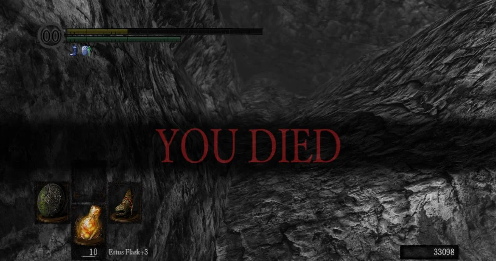
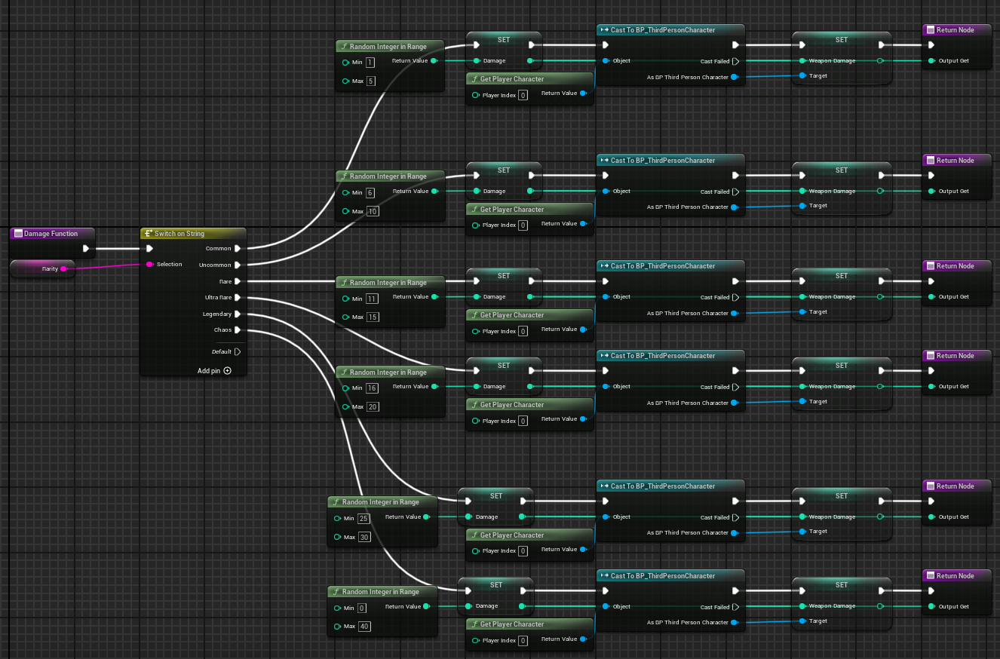

# Soulslike Impact
 

# Week One

## Colour Blindness

- Different colour blindness can perceive colours differently.
- Symbols are a main way to show differences. Caduceus for health, or a heart symbol
- Consider haptic feedback with a controller, consider a heartbeat
- Make the edge of the screen darker to show the
 - Audio for healing potions and taking damage, or a heartbeat
---
  
  

## Controller Support

 - The Playstation 5 controller has a different scheme to the Playstation 4 controller.
  - Uses completely separate axis settings, needing a lot of trial and error to find the correct settings.
  - The Playstation 4 controller uses 'Generic Gamepad Axis 1 through 3, whereas the Playstation 5 controller Uses 'Generic Gamepad Axis 4 through 7
  - Mapping buttons to specific actions was incredibly easy, just requiring a new input for specific buttons. However, I also had to create multiple new keybinds, such as;
    * Dodge/Run,
    * Light Attack,
    * Heavy Attack,
    * Drink Potion,
    * Collect/Switch Items,
    * Lock on,
---

 
 

## Movement System

 - The Movement system is rather simplistic, being based on other souls-like games
 - There are three new movement buttons:
   * Sprint
   * Backstep (Tap sprint button while not moving)
   * Dodge (Tap the sprint button while moving.)

 - Soulslike games put emphasis on timing and being careful with movements. So This is what I am using for my movement system. I want it to be very similar, so there will be fewer movement options.
 - However, Like other soul-like games, I will be including a lock-on system, which makes it a little easier for people in games such as this, where enemies have such large and coordinated movements.
---
  
  

## Weapons
### Weapon Types
---
There will be a few different types of weapons, each with its own set of animations. These types are:
  * Swords, which have a very short range
  * Spears, which have a long-range, but only stab
  * Scythes, which have a long-range, slashing at the enemy(s)
  * Greatsowrds, which have a medium range, slashing the enemy(s)
Alongside this, there will be a different type of stats for each weapon.
----
### Weapon Stats
---
 Each weapon will have three main Stat - Damage, Attack Speed and Stamina Drain. All of which are rather easy to understand what they will do. I will also have different stats for different weapon types, some can be shared, others cannot.
  - Shared stats;
     * Bleed
     * Slowness
 - Sword Stats;
   * Poison
- Spear Stats;
   * Piercing
- Scythe Stats;
    * Fire,
    * Lifesteal,
 - Greatsword Stats;

## Research

## Respawn System

For the respawn system I wanted to use one that had the iconic 'You Died' System from all the soulslike games. This will include a slow death animation from the character, before the dark bar appears on screen, with the 'You Died' text.

](image.png)
*Figure 1. Shows an example of a death screen from the game Dark Souls One.*

I wanted to stick as close to the original source as possible. This was done by creating a new User Interface that would pop up when a player died. This would then call up the small animation I had created for the UI, the black bar and red text showing up for a moment before vanishing. This UI is then instantly killed as it is no longer necessary.

---

 
 

# Week 2

### Controller Support
 - Controller support became an issue. Playstation controllers were unusable after Unreal Engine 5. Controllers require a plugin that has not been updated and therefore is very unreliable. So after long enough of attempting to fix the issues, I had to give up with PlayStation four or five controllers.
 - However, I also had plans to use Xbox controllers, which are supported by Windows, and therefore are easy to set up with the controller. After this, all I needed to do was to make a bunch of extra input actions for every single button, which didn't take long at all.

---

### Player UI
 - Created the UI
 - Made a simple health bar, with the plan to add the stamina bar in the future. I then also added the visual of an Estus Flask as a temporary object for the prototype, which I will have to amend in the future. Since then I also added a small image above the health flask to show what weapon the player had equipped.
 ---

 ### Research
 ---
 - For this week I researched the Minecraft modpack 'Vault Hunters'. It is a mod pack based around looting dungeons for new weapons, resources and upgrades for your Minecraft world. One of the key features is the randomized gear, which you can gain gear from little crates, or random enemy or chest drops from the vaults.
 - The randomized gear can have different status effects, from higher damage, to quicker attack speed. The full list is;
    * Attack Damage
    * Attack Speed
    * Durability
    * Chaining
    * Soul Chance
    * Effect Clouds
    * Effect Chance

- These can be found or crafted, with percentage chances on the modifiers on the weapons. The amount of modifiers and the percentage of the modifiers are affected by the rarity of the weapon itself. I looked at these weapons and thought it could be a unique and interesting way to fight enemies, making it a unique game.
- An example of this could be: I have an element called Frost, when you hit an enemy with a weapon imbued by frost, they will slow by a certain amount.
- When hit, they will have a build-up of frost, for this example, I will say it is a build-up of 33% a hit.
  * Hit 1 - 33% build-up, 33% slowed
  * Hit 2 - 66% build-up, 66% slowed
  * Hit 3 - 99% build-up, 99% slowed
  * Hit 4 - 100% build-up, 100% slowed
- When it hits 100% build-up, It will trigger a further status effect. In this example it is shatter, which will deal a percentage of damage to the enemy, changing based on resistance.
---

 
 

# Week :3
---
 

## Randomized Weapons

 - The random weapon system is rather simple when made.
 - When you get to an actor that will be a chest, the player will use the interaction button. From there, the blueprint will begin to randomise the new weapons stats.
 - The blueprint will first decide the weapon rarity, choosing from:
    * Common
    * Uncommon
    * Rare
    * Ultra Rare
    * Legendary
    * Chaos
 - Each weapon will have different Stats, and different weapon types have different status effects. The common weapons will have very basic stats, having a maximum of ten damage.
  
  

 
*Figure 2. Shows a picture of the weapon damage function, and it shows the way it is set up.*
---
 

- This same setup is how I have created the rest of the weapon stats. I got a rarity, gave it a max and a minimum number for the stat and got a randomized number. Each of the rarities has increasingly higher numbers for the stats.
- The chaos tier is different, however. Inspired by a friend, I decided to create a tier that was quite literally 1-100. These weapons could have 1 Damage, but 100 attack speed.
- When it comes to the additional statuses on the weapon, I originally had the idea of having a random number of stats, so a weapon could potentially have effects such as Bleed, frost and life steal on it. However thinking about this, it would be far too overpowered, especially for a game inspired by games such as Dark Souls, which are notoriously difficult.

 
 

## Issues
- Here I found an interesting issue. I originally wanted to store the weapon data instructions. I wanted to have 5 different structs to store the data for 5 separate weapons. However, when I tried to store data in them, and then call them in the future, I couldn't find any way to access them. Even directly after I had just set the data in the struct.
- I couldn't find any solution to this issue, nor could I figure out any way to get the structs to work. So in the end I simply made the variables themselves and gave them to the player, with plans to have other weapons be sent to separate actors with the individual stats. This works now, as I can set new weapons.
- In the full game, I will modify the spawner so that it creates weapons that are considered Actors so that the player can have full control of what weapon they are currently using.

 

# Week 4

## Basic enemies
 - I wanted to create enemies for the prototype who had the functionality to walk up to the player and attack them. Apart from that, they did not need much more.
 - In the future, I plan on making sure the enemies will be equipped with shields and can block the player's attacks. But that will be in the full game, not the prototype.
 - I created a basic pawn, before giving it an AI controller. This of course, then ran the blackboard, which was simple. The only commands the enemies have are to locate the player, move to the player and then attack the player.
 - It was simple to do, as soon as the enemy was in range, they would attack the player. I did this by starting a function, which checked to see if they were already attacking. If they were not, it would play an anim montage. During this, it would cast to the player, and deal damage to the player.
 - I created an animated montage because I wanted to add more animations in the future and allow flexibility for child actors.
 
- Originally, I had no delay between the animations, at which point I found out that the enemy could attack me as quickly as there were frames. This was found out in the first test, when an enemy dealt too much damage to me, an issue that was quickly fixed.

 

# Week 5

## Lock on system

- For my game, I decided to use a lock-on system for the enemy. This means that no matter where the enemy is, the camera will always lock on to the enemy, and will face. I took inspiration from other games that have similar features.

- Some games like the Souls games have a hard lock-on, in which you have to actively select the enemy you wish to lock onto and target. However other games such as Dragon Age: Veilguard has a soft lock on. It doesn't restrict your camera and will allow you to look freely around. However, in the interest of attacking, it will lock you onto one character, that you can easily look away from.

- The system itself is rather simple. All I had to do was to create an input to lock on. Tab on PC, and press in on the camera joycon on the controller. These, I have found, are often normal controls for this type of system.
- When pressed, it will send a sphere trace. The starting point will be the player, the endpoint will be the camera direction, set a distance away from the user. Once it finds an enemy, it will set the rotation of the camera to be facing the target.
- I did find, however, that in most cases all you would be able to see is simply behind the player, so I made sure the camera was slightly elevated so that it was always possible to see enemies directly in front of you.

 

# Week 6
 
 ## Fighting system
- For this, I knew I already wanted three types of attacks.
  * A basic attack.
  * A heavy attack.
  * A special attack.
- For these, I got the three animations. I then had to figure out how to retarget animations. It took me a while to figure out how to do this, before then suddenly finding the button simply titled 'Retarget Animation'. I retargeted all three animations, before setting up the buttons, below is how it works:
  * The button is hit, and it checks to see if you are already attacking.
  * If not, then it will disable the player's movement.
  * Afterwards, it would then play the animation montage.
  * During certain points in the animation, it would start an anim node titled "hit"
  * "Hit" would then draw a line trace down the weapon length, before checking to see if it hit enemies.
  * Once hit, it will deal damage to the enemies and allow the player to move.
  * Then the system would say you are no longer attacking.

- Here I once again used anim montages. This is for future support. In the future, I plan on adding more animations for basic attacks, as well as different weapons.
- Each weapon will have its own moveset, as well as its own special attacks. At the moment I only have one type of weapon and one moveset, but plan to have multiple more.

 

 ## Weapon Affliction system
 - The weapon affliction system was nice and simple.
 - The overall idea is that separate weapons will give different effects, based on whatever the random effect that they spawned with was. I then gave each of them a build-up number. When hit with this, the enemy would have a constant build-up of the effect.
 - When the build-up would reach 100% then it would trigger the effect.
    * Frost will shatter the enemy, killing it the most.
    * Fire will cause an AOE attack.
    * Lifesteal will damage the enemy and heal the player
    * Scarlet rot will slowly the enemies over time.
    * Bleed will damage the enemy for a percent of their remaining health.
- However, most of these do not have functionality. This is due to the fact that I overestimated the time that making the weapon rarity system would take, as I kept rewriting the system.

 
 

# Week 7

## Dodging

- I wanted a dodge that was functionally similar to a roll, where for a few moments you will be invincible. So that you dodge out of the way of attacks.
- However, I wanted to do a quick dash out of the way instead of a dodge. I chose that it would work as such:
  * You go invisible
  * You dash forward
  * You become visible.

- When making this, I encountered a simple issue. Instead of dashing the way the player was facing, you would dash in a single direction, no matter what direction you were facing.
- This was due to the fact I was using the capsule component, which didn't change directions. To fix this I would then quickly add an arrow to the player. I got the world location and forward vector, multiplied by 25, before adding to the player's current world location. This then worked, allowing me to get the direction the player was facing.
- I didn't want this to work via the camera, as when playing on the controller it can be quite slow. And when needing to press at a moment's notice, having it based on the direction you are moving is a lot more pleasing for the player's experiance.

# Week 8

testing

dungeon making.

# week 9
testing

others

healing

issues

what i plan to do.

 
 
 

 # Bibliography
---
 https://vaulthunters.gg/ 

 
 :3